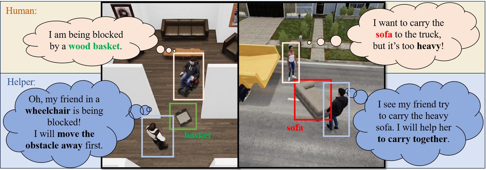

# Constrained Human-AI Cooperation (CHAIC): An Inclusive Embodied Social Intelligence Challenge

## ✨ Introduction
This is the anomyous raw code for the NeurIPS Dataset Track submission CHAIC.
[[Project Page](https://chaic-neurips.github.io/CHAIC/ )]

> We introduce the Constrained Human-AI Cooperation (CHAIC), an inclusive embodied social intelligence challenge for testing social perception and cooperation in embodied agents. In CHAIC, the goal is for an embodied agent equipped with egocentric observations to aid a human possibly operating under physical constraints, e.g. unable to reach high places or confined to a wheelchair, to perform common household or outdoor tasks as efficiently as possible. To do this, a successful helper must (1). infer the human's intents and constraints by following the human and observing their behaviors (social perception), and (2). make a cooperative plan tailored to the human user to solve the task as fast as possible together as a team (cooperative planning). 
To benchmark this challenge, we created 4 new agents with real physical constraints, and 8 long-horizon tasks featuring both indoor and outdoor scenes with various constraints and emergency events along with potential risks. We benchmark both planning and learning baselines on the challenge and introduce a new method leveraging Large Language Models and behavior modeling. Empirical evaluation demonstrates the ability of our benchmark to enable systematic evaluation of important elements of machine social intelligence.

<div>
<center>

</div>

## 🛠️ Setup

**Step 1:** Run the following commands step by step to setup the environments:

```bash
conda create -n CHAIC python=3.9
conda activate CHAIC
pip3 install -e .
pip3 install torch==1.13.1+cu117 torchvision==0.14.1+cu117 \
  torchaudio==0.13.1 --extra-index-url https://download.pytorch.org/whl/cu117
```

If you are running in a remote server without a screen, please refer to [running TDW in server](https://github.com/threedworld-mit/tdw/blob/master/Documentation/lessons/setup/server.md).

After that, you can run the demo scene to verify your setup:

```bash
python demo/demo_scene.py
```

**Step 2:** Install and download pre-trained perception models:

```bash
pip install -U openmim
mim install mmengine
mim install mmdet
pip install mmaction2
bash detection_pipeline/download_ckpt.sh
```

After that, you can run the perception demos to verify them:

```bash
python tdw-gym/detection.py
python tdw-gym/behavior.py
```

**Notice:** There maybe exists some internal bugs in the `mmaction` package, and you can refer to the [Github issue](https://github.com/open-mmlab/mmaction2/issues/2714) to fix it when you meet trouble.

## 💾 Codebase Layout
Some important folders and their corresponding functions are listed here.
```
|__ tdw-gym/                         Main code
|
|__ scenes/                          Code for dataset generation
|
|__ dataset/                         Dataset configuration and storage
|
|__ transport_challenge_multi_agent/ Low level controller
|
|__ scripts/                         Scripts for running experiments
|
|__ detection_pipeline/              Code for perception models
|
|__ LM_agent/                        LLM & VLM Prompt
```

## 💫 Run Experiments

We prepare all the experiment scripts to run experiments under the folder `scripts`. For example, to run experiments with Random Helper in the highthing setting, you can use the following command:

```bash
bash scripts/random_helper/test_high_thing_random_helper.sh
```

By adding ``--gt_mask`` or ``--gt_behavior`` in the scripts, the environment will provide ground truth object segmentation masks or ground truth behaviors of the partner, respectively.

**Notice:** If you want to test the LLM+BM helper or the VLM helper, you need to fill your ``AzureOpenAI`` setting or ``OPENAI_API_KEY`` at line 73-77 in ``LM_agent/LLM.py`` or line 74-78 in ``LM_agent/VLM.py``.

## 🧾 Benchmark Overview

### Multi-Agent Asynchronized Setting

Agents may take different number of frames to finish (or fail) one action, and one env step is finished until any agent's action is not under the ongoing status, and the current obs is returned to all agents. Then, 
all agents are asked for a new action, and any agent having ongoing action will directly switch to the new action if its action changed. 